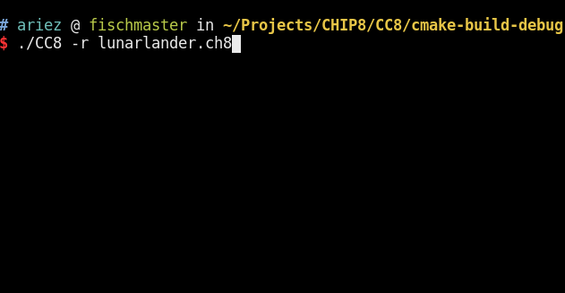

# CC8 CHIP-8 interpreter

A [CHIP-8](https://en.wikipedia.org/wiki/CHIP-8) interpreter/disassembler written in C.

## Features

* Disassembler and debugger with color output
* Terminal graphics using ▀,▄,█ chars
* Cinematic ~10FPS framerate
* Segfaults only occasionally

